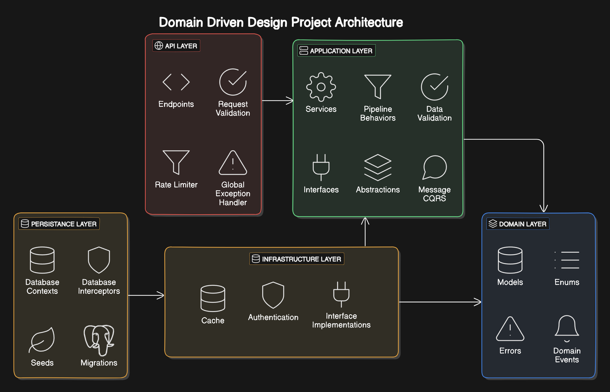

# Clash Royale REST API

College project for the course of Software Engineering.

## Architecture

The architecture of the project is a monolithic REST Minimal API.
DDD (Domain-Driven Design) is used to structure the project.

## Patterns
It was used the following patterns:
- **Repository Pattern**: To abstract the data access layer
- **Service Pattern**: To abstract the business logic
- **CQRS (Command Query Responsibility Segregation)**: To separate the read and write operations
- **Decorator Pattern**: To add extra behavior to some services like Cache, Logging
- **Unit of Work Pattern**: To manage transactions
- **Result Pattern**: To return the result of the operations
- **Validation Pattern**: To validate the data
- **DTO (Data Transfer Object) Pattern**: To transfer the data between the layers
- **Authentication and Authorization using JWT**: To authenticate and authorize the users. Custom Authentication and Authorization using Claims and Permissions

## DDD Project Architecture

## Technologies
- **.NET 8**: To build the application
- **Entity Framework Core**: To access the database, create the migrations and seed the data, to manage transactions, tracking changes
- **PostgreSQL**: To store the data
- **MediatR**: To implement the CQRS pattern
- **FluentValidation**: To validate the data
- **Redis**: To cache the data

## Extras
- **Swagger**: To document the API
- **Docker**: To containerize the application
- **Kubernetes**: To manage the containers